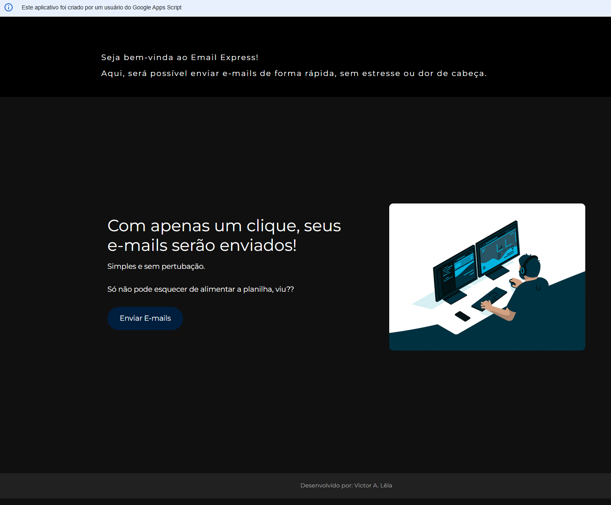
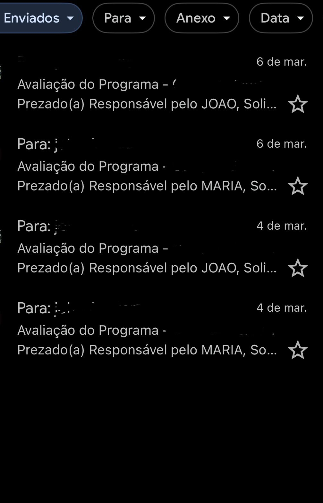

# Automatização de Envio de E-mails - Google Apps Script


## Sobre o Projeto

Sistema desenvolvido com Google Apps Script para automatizar o envio de e-mails personalizados a beneficiários do Programa Computadores para Inclusão. A solução realiza a leitura automática de uma base de dados armazenada em planilhas Google Sheets e gera mensagens individualizadas contendo informações específicas de cada destinatário, além de links para formulários de satisfação.

O projeto foi criado para eliminar processos repetitivos de envio manual, garantindo maior agilidade, padronização da comunicação e redução significativa do tempo operacional.

---

## Screenshots

### Tela de gerenciamento dos envios



### Exemplo de e-mail enviado



---

## Funcionalidades

* Leitura automática de dados em planilhas Google Sheets
* Envio em lote de e-mails personalizados
* Personalização por nome do beneficiário
* Inclusão automática de quantidade de equipamentos recebidos
* Inclusão automática da data de doação
* Inserção de links para formulários de satisfação
* Redução de atividades repetitivas e manuais
* Registro e acompanhamento dos envios realizados

---

## Tecnologias Utilizadas

| Tecnologia         | Descrição                                        |
| ------------------ | ------------------------------------------------ |
| Google Apps Script | Automação dos disparos e integração dos serviços |
| Google Sheets      | Base de dados dos destinatários                  |
| Gmail              | Envio automatizado das mensagens                 |

---

## Estrutura do Projeto

* email-automation/
* |
* |--- src/ # Código Apps Script de exemplo
* |--- docs/ # Prints de demonstração
* |--- resultados/ # Evidências de envio e recebimento dos e-mails
* |--- README.md

---

## Como Executar

1. Clone o repositório:

   ```bash
   git clone https://github.com/ProfissionalJV/email-automation.git
   ```

2. Configure a planilha Google Sheets com os dados dos destinatários

3. Vincule o script ao ambiente Google Apps Script

4. Ajuste os modelos de e-mail e parâmetros desejados

5. Execute a automação para realizar os disparos em lote

---

## Observação

As estruturas reais e originais possuem informações privadas e de uso interno. Os códigos, modelos de mensagens e exemplos apresentados foram adaptados exclusivamente para fins de demonstração, documentação e composição de portfólio.

---

## Autor

**Victor Arsego Lêla**

* Desenvolvedor Web e Automatizador de Processos
* Engenharia da Computação - CEUB
* Gestão Pública - Estácio
* [LinkedIn](https://www.linkedin.com/in/vltech/)
